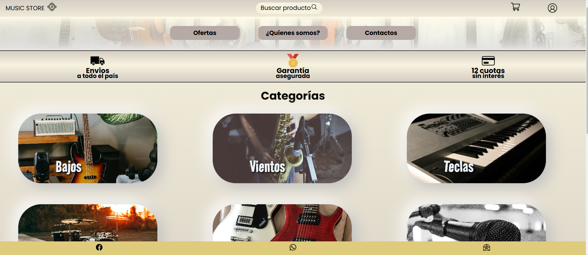

# Music Store        

El proyecto *Music Store* es un E-Commerce de productos musicales. Este es el proyecto final del curso de 
desarrollo web de Coderhouse 

## Tecnologías Utilizadas

- HTML: Para estructurar el contenido de la página web.
- Sass: Para mejorar la gestión de los estilos CSS y facilitar la personalización y reutilización de los mismos.
- Bootstrap: Se utilizó un componente de Bootstrap en la sección de pagos para mejorar la funcionalidad y diseño del proceso de compra.

## Características del Proyecto

- *Interfaz Responsive*: El diseño está completamente adaptado a diferentes tamaños de pantalla, asegurando una experiencia de usuario óptima tanto en dispositivos de escritorio como en móviles y tablets.
- *Estilos Personalizados con Sass*: Los estilos fueron creados utilizando Css.Y luego migrado a Sass permitiendo una mayor organización y flexibilidad en el código.

## Capturas de Pantalla

A continuación se presentan algunas capturas de pantalla del proyecto en diferentes dispositivos:

1. *Vista de Escritorio*  
   

2. *Tablet*  
   

3. *Móvil*  
   

## Conclusión

Este proyecto final demuestra la aplicación de técnicas de diseño web modernas y herramientas populares para la creación de una tienda en línea completamente funcional y adaptable. La utilización de HTML, Sass y Bootstrap permitió lograr un diseño limpio, eficiente y fácil de mantener.